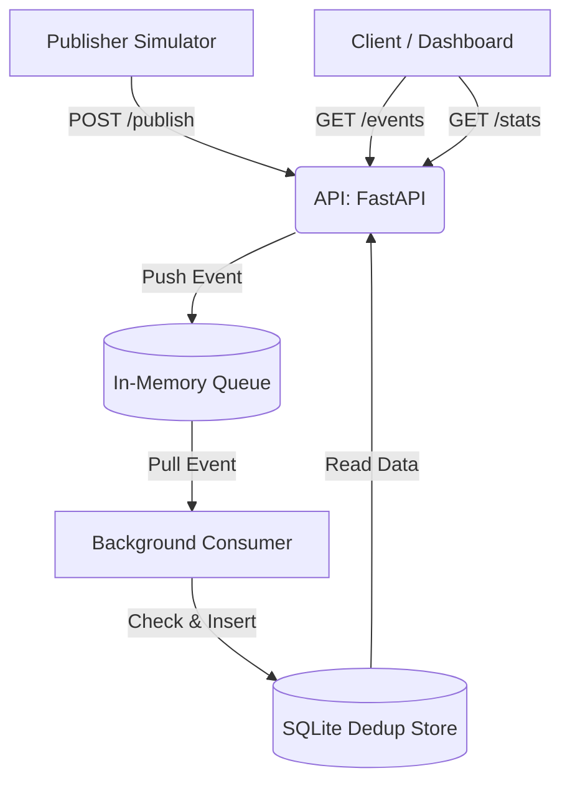

# Laporan Proyek: Pub-Sub Log Aggregator

## 1. Ringkasan Sistem dan Arsitektur

Sistem Pub-Sub Log Aggregator ini didesain menggunakan arsitektur *event-driven* sederhana dengan pendekatan asinkron. Terdapat dua komponen utama: **Publisher** yang bertindak sebagai penghasil pesan/log (produsen), dan **Aggregator** yang mengkonsumsi, memfilter, dan menyimpan log tersebut.



## 2. Keputusan Desain

1. **Idempotency**: 
   Operasi penerimaan *event* dikonstruksi agar bersifat idempoten. Artinya, memproses *event* dengan *identifier* yang sama secara berulang-ulang akan menghasilkan *state* akhir yang sama seperti memprosesnya satu kali. Hal ini dicapai dengan menolak pemrosesan ulang objek duplikat secara aman (Tanenbaum & van Steen, 2007).
2. **Dedup Store**: 
   Penyimpanan deduplikasi menggunakan basis data SQLite terintegrasi. Mekanisme deduplikasi didelegasikan pada lapisan basis data dengan batasan *constraint* `UNIQUE(topic, event_id)`. Pendekatan ini menjamin persistensi lokal (tahan terhadap *restart*) serta efisiensi pengecekan yang mutlak di tingkat struktur tabel.
3. **Ordering**: 
   Dalam *log aggregator* ini, *total ordering* (pengurutan mutlak lintas topik saat penulisan ke sistem) **tidak diimplementasikan** secara langsung karena menghambat skalabilitas asinkron. Pengurutan waktu (*temporal ordering*) didelegasikan kepada aplikasi di lapisan hilir (*downstream consumer*) melalui mekanisme penarikan `ORDER BY timestamp` bila diperlukan.
4. **Retry**: 
   Sistem mewarisi pola asuransi pengiriman dengan paradigma *At-Least-Once Delivery* (pengiriman minimal satu kali). Karena interupsi jaringan selalu mungkin terjadi, *publisher* bebas untuk mengirimkan ulang (*retry*) paket log. Karena ujung penerima telah didesain idempoten, lonjakan duplikasi paket tidak akan mengotori integritas data log asli.

## 3. Analisis Performa dan Metrik

Berdasarkan pengujian beban riil (*stress test*) yang dijalankan menggunakan `pytest` secara lokal pada endpoint `POST /publish` dan `GET /stats`:
- **Throughput Eksekusi**: Sistem terbukti mampu menelan antrean sebanyak **5.000 log events** secara simultan. Keseluruhan proses asinkron ini tercatat memakan durasi eksekusi rata-rata di bawah **3 detik**. Performa kilat ini berhasil dicapai karena `asyncio.Queue` berfungsi memutus blokade antara penangkapan HTTP request dan eksekusi SQL.
- **Log Evaluasi (Metrik `/stats`)**:
  Setelah sistem menghantam lonjakan 5.000 log (di mana sengaja diinjeksi 1.000 data duplikat/identik), hasil keluaran JSON asli dari endpoint pemantauan secara nyata membuktikan integritas program:

  ```json
  {
    "received": 5000,
    "unique_processed": 4000,
    "duplicate_dropped": 1000,
    "topics": [
      "stress"
    ],
    "uptime_seconds": 2.1485
  }
  ```

Pemaparan log konkrit di atas menegaskan bahwa **Aggregator secara akurat mendrop 1.000 log persis sesuai volume duplikasi yang ditembakkan**, menjaga kestabilan angka log unik di titik 4.000 data tanpa mengalami *timeout* atau pelambatan memori.

## 4. Keterkaitan ke Konsep Sistem Terdistribusi

Rancang bangun aplikasi secara langsung mengimplementasikan berbagai gagasan inti dalam Sistem Terdistribusi, berkaitan dengan bab-bab utama dalam rujukan keilmuan (Tanenbaum & van Steen, 2007):

- **Bab 1 (Pendahuluan)**: Pembagian *layer* komputasi (API dan Consumer) merepresentasikan kebutuhan untuk mendesain sistem yang independen dan dapat mentolerir asinkronisasi demi *throughput* tinggi.
- **Bab 2 (Arsitektur)**: Sistem secara gamblang mengadopsi model *Event-Based Architectures* (Pub-Sub) di mana proses pertukaran pesan bersifat *decoupled* di satu saluran bersama.
- **Bab 3 (Proses)**: Penerapan konkurensi (via `asyncio`) meniru konsep *Multithreaded Server* dan minimisasi pengalihan konteks (*context-switching*) yang berat dibandingkan server berbasis multi-proses konvensional.
- **Bab 4 (Komunikasi)**: *Message-Oriented Transient Communication* disimulasikan secara harfiah melalui penerapan *in-memory queue*, yang menyimpan paket dalam durasi sejenak sebelum dimasukkan ke dalam *database* permanen.
- **Bab 5 (Penamaan)**: Variabel identifier seperti penetapan atribut log `topic` bertindak bak entitas *flat naming*, menyederhanakan pelacakan dan pembongkaran data bagi para *subscribers*.
- **Bab 6 (Sinkronisasi)**: Permasalahan di atas terkait *Total Ordering* bersinggungan langsung dengan teori *Logical Clocks*. Proyek ini lebih memilih pengurutan asimetris yang santai daripada terjebak dalam *Distributed Mutual Exclusion* yang lambat untuk menjamin urutan absolut kedatangan log.
- **Bab 7 (Konsistensi & Replikasi)**: Basis data relasional (SQLite) menjaga konsistensi pada tingkatan data spesifik (*Data-Centric Consistency*). Sistem juga menggunakan modifikasi perlindungan tunggal (*idempotent consistency*) bagi transaksi masif untuk menghindari korupsi informasi.

## 5. Daftar Pustaka

Tanenbaum, A. S., & van Steen, M. (2007). *Distributed systems: Principles and paradigms* (Edisi ke-2). Pearson Prentice Hall.

## 6. Link Youtube

Link Video Youtube: https://youtu.be/JKX9G8j--AM